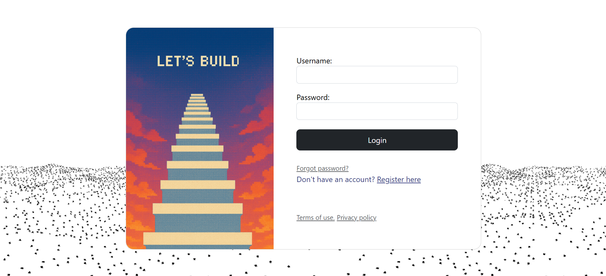
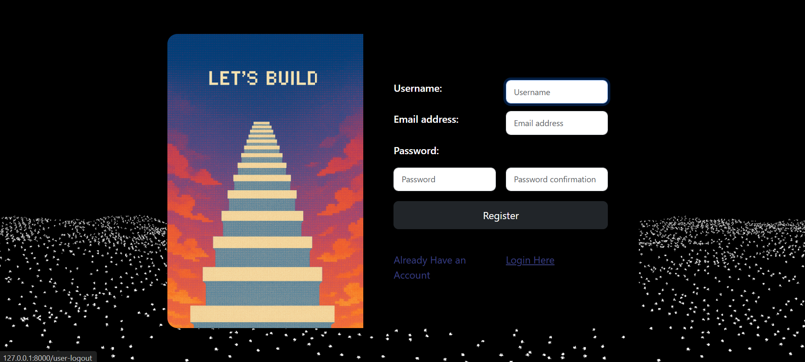
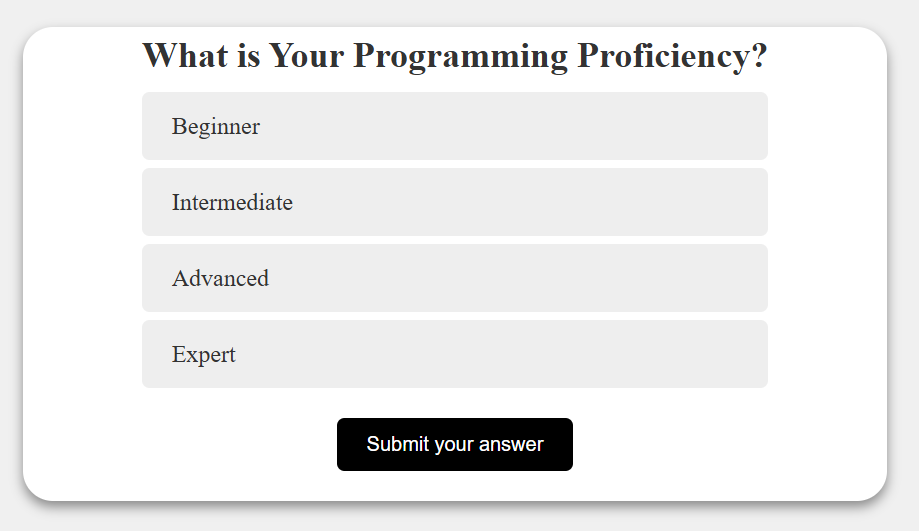

## Let’s Build (Django)

### AI-assisted project ideas you’ll actually want to build.

Let’s Build is a Django web app that helps you discover projects aligned with your personality and interests. 
Take a short quiz → get AI-generated project ideas → follow step-by-step build guides to learn along the way.

### What it Will Do

The goal of Lets Build is to get programmers stuck in 'tutorial hell' onto the right track. If you have spent 
hours on a project, Leetcode questions you don't care about, and find your self uninspired, this is for you.
Let's Build will be an all in one project assistant, not doing the work for you, but simply helping you 
structure them. You will be so busy building something you enjoy that you won't notice how much you have
learned.

### Sign in Examples:

#### Login: 

#### Register: 

### Quiz Examples:

#### Quiz Entry:

#### Quiz Questions:

### Open Source Statement

Lets Build is free and open source software, feel free to use and modify it in any way you see fit